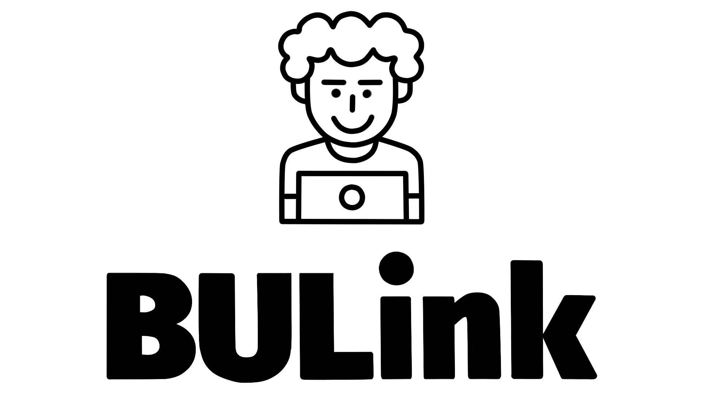

# Bulink – web-чат с системой мгновенного обмена текстовыми сообщениями и медиа файлов для браузеров.

***
### Описание:
web-чат включает в себя 4 web-страницы: авторизацию, регистрацию, меню с выбором, поиском и добавлением чатов и страницу с подобранным через меню чатом. Данный проект был реализован в рамках учебной практики студентами первого курса кафедры ИУ9 МГТУ им. Н. Э. Баумана.
***
### Разработчики:
* Резепин Никита [teamlead, front-end] : [@not-Whale](https://github.com/not-Whale)
* Жолтиков Михаил [back-end] : [@Klaus1901](https://github.com/Klaus1901)
* Иванов Максим [database] : [@maksimellian](https://github.com/maksimellian)
* Якушев Константин [front-end] : [@YakushevK](https://github.com/YakushevK)
* Максимов Евгений [front-end] : [@maxevg](https://github.com/maxevg)
* Костриця Максим [support] : [@MaksimKoster](https://github.com/MaksimKoster)
***
### Инструкция по запуску:
* Установить(если еще не установлена) MongoDB
* Установка зависимостей: npm install
* Запуск: node Chat/app.js
